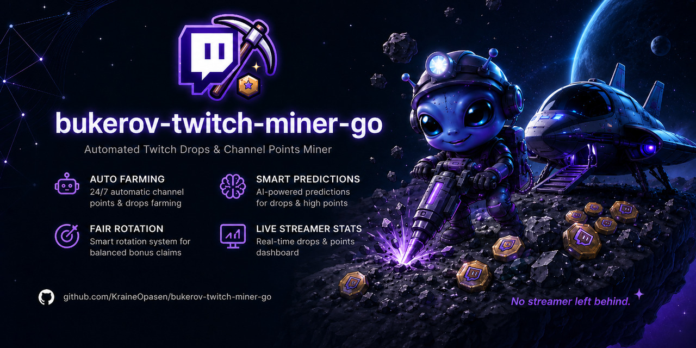

<p align="center">
  
</p>

# Twitch Channel Points Miner

[](https://github.com/KraineOpasen/bukerov-twitch-miner-go/actions/workflows/ci.yml)
[](https://github.com/KraineOpasen/bukerov-twitch-miner-go/releases)
[](https://github.com/KraineOpasen/bukerov-twitch-miner-go/releases)

A fork of [PatrickWalther/twitch-miner-go](https://github.com/PatrickWalther/twitch-miner-go).

This tool passively earns Twitch channel points by simulating viewer presence across multiple streams.

## Features

- **Passive Point Farming**: Earn channel points (+10-12 every 5 minutes) by simulating watch time
- **Automatic Bonus Claiming**: Auto-claim +50 point bonuses when available
- **Watch Streak Detection**: Catch +450 point watch streaks across streamers
- **Raid Following**: Automatically join raids for +250 points
- **Prediction Betting**: Intelligent automated betting on channel predictions with multiple strategies
- **Game Drops**: Track and claim game drops from inventory
- **Channel-Restricted Drop Priority**: Correctly prioritizes campaigns limited to specific channels, watching a permitted channel when one is required
- **Drop Claim Deduplication**: Skips drop campaigns already claimed according to Twitch's account claim history
- **Drop Name Blacklist**: Skip unwanted drop campaigns by keyword
- **Directory Channel Discovery**: For configured games, automatically finds live drops-enabled channels in the Twitch directory and farms the most-viewed one in an extra watch slot, switching channels when they go offline or their drops end — no need to list them as streamers
- **Moments Claiming**: Automatically claim Twitch Moments when available
- **Community Goals**: Contribute channel points to streamer community goals, with optional per-contribution limits (percentage of balance and absolute cap)
- **Per-Streamer Rotation Preference**: Nudge the watch rotation to prefer or avoid specific streamers when priority is otherwise equal
- **Multi-Streamer Support**: Monitor multiple streamers with priority-based scheduling
- **Resilient Twitch API**: GQL retry with exponential backoff on transient errors, plus client-ID fallback on `PersistedQueryNotFound`
- **Connection Health Watchdog**: Detects auth-token expiry and connection loss (dashboard banner, Discord alert, error log) and recovers when activity resumes
- **Real-time Analytics**: Web-based dashboard for tracking point earnings, including a dedicated **Drops** page
- **Notifications**: Get notified for mentions, point goals, and stream status changes via Discord, Matrix, Pushover, Gotify, or a generic webhook — with optional event batching
- **Colored Console Logging**: Optional category-based color scheme for console output
- **Diagnostics Endpoint**: Optional localhost-only debug HTTP server exposing the miner's internal decision state

## Quick Start

Choose one of the four installation methods below.

| Method | Best For |
|--------|----------|
| [Docker](#option-1-docker-recommended) | Most users, easiest setup |
| [Binary Download](#option-2-binary-download) | Running natively without Docker |
| [Unraid](#option-3-unraid) | Unraid server users |
| [Build from Source](#option-4-build-from-source) | Developers, contributors |

---

## Option 1: Docker (Recommended)

New to Docker? See [Docker's getting started guide](https://docs.docker.com/get-started/) or install [Docker Desktop](https://docs.docker.com/desktop/) for Windows/macOS.

### Step 1: Create directories and config

```bash
# Create directories for persistent data
mkdir -p ~/twitch-miner/{config,cookies,logs,database}

# Create a minimal config file
cat > ~/twitch-miner/config/config.json << 'EOF'
{
  "username": "your_twitch_username",
  "enableAnalytics": true,
  "streamers": [
    { "username": "streamer1" },
    { "username": "streamer2" }
  ]
}
EOF
```

Edit `~/twitch-miner/config/config.json` with your Twitch username and the streamers you want to watch.

### Step 2: Run the container

```bash
docker run -d \
  --name twitch-miner \
  -e DASHBOARD_USERNAME=admin \
  -e DASHBOARD_PASSWORD=your-secure-password \
  -v ~/twitch-miner/config:/config \
  -v ~/twitch-miner/cookies:/cookies \
  -v ~/twitch-miner/logs:/logs \
  -v ~/twitch-miner/database:/database \
  -p 5000:5000 \
  ghcr.io/kraineopasen/bukerov-twitch-miner-go:latest
```

> **Note:** dashboard credentials are **required** in containers. The image
> binds the dashboard to all container interfaces (`DASHBOARD_HOST=0.0.0.0`)
> so the published port works, and the miner refuses to start on a
> non-loopback bind without `DASHBOARD_USERNAME`/`DASHBOARD_PASSWORD` (see
> [Security defaults](#security-defaults)).

### Step 3: Authenticate with Twitch

Open http://localhost:5000 in your browser. The dashboard will show the authentication prompt with a code and link.

1. Click the link or go to https://www.twitch.tv/activate
2. Enter the code displayed
3. The miner will automatically continue once authenticated

**Running headless?** View the authentication code in the logs instead:
```bash
docker logs -f twitch-miner
```

### Step 4: Access the dashboard

Once authenticated, the dashboard shows all your streamers, points, and earnings.

### Dashboard authentication

Containers must set `DASHBOARD_USERNAME`/`DASHBOARD_PASSWORD` (already shown
in Step 2). If you consciously want an **unauthenticated** dashboard on a
trusted network instead, opt out explicitly — otherwise the container exits
at startup with an explanatory error:

```bash
  -e DASHBOARD_INSECURE_NO_AUTH=true \
```

### About the image

The container image is published only to the GitHub Container Registry (GHCR); there is no Docker Hub image for this fork.

```bash
docker pull ghcr.io/kraineopasen/bukerov-twitch-miner-go:latest
```

### Using Docker Compose

A ready-to-use [`docker-compose.yml`](docker-compose.yml) is included. It enables
[Automatic Updates](#automatic-updates), sets `restart: unless-stopped` (required
for updates to take effect), and excludes the container from Watchtower:

```bash
# From a directory containing docker-compose.yml and your config/ folder
docker compose up -d
```

---

## Option 2: Binary Download

### Step 1: Download the binary

Download the latest release for your platform from the [Releases page](https://github.com/KraineOpasen/bukerov-twitch-miner-go/releases).

| Platform | File |
|----------|------|
| Windows | `twitch-miner-go-windows-amd64.exe` |
| Linux (x64) | `twitch-miner-go-linux-amd64` |
| Linux (ARM64) | `twitch-miner-go-linux-arm64` |
| macOS (Intel) | `twitch-miner-go-darwin-amd64` |
| macOS (Apple Silicon) | `twitch-miner-go-darwin-arm64` |

### Step 2: Generate a config file

```bash
# Linux/macOS
./twitch-miner-go -generate-config

# Windows
.\twitch-miner-go.exe -generate-config
```

This creates `config.sample.json`. Rename it to `config.json`:

```bash
mv config.sample.json config.json
```

### Step 3: Edit the config

Open `config.json` and set your Twitch username and streamers:

```json
{
  "username": "your_twitch_username",
  "enableAnalytics": true,
  "streamers": [
    { "username": "streamer1" },
    { "username": "streamer2" }
  ]
}
```

See [Configuration Reference](#configuration-reference) for all options.

### Step 4: Run the miner

```bash
# Linux/macOS
./twitch-miner-go

# Windows
.\twitch-miner-go.exe
```

### Step 5: Authenticate with Twitch

Open http://localhost:5000 in your browser. The dashboard will show the authentication prompt with a code and link.

1. Click the link or go to https://www.twitch.tv/activate
2. Enter the code displayed
3. The miner will automatically continue once authenticated

### Step 6: Use the dashboard

Once authenticated, the dashboard shows all your streamers, points, and earnings.

### Command-line options

| Flag | Description |
|------|-------------|
| `-config path/to/config.json` | Use a custom config file location |
| `-debug` | Enable debug logging |
| `-generate-config` | Generate a sample configuration file |
| `-auto-update` | Automatically download and apply new GitHub releases, then restart (see [Automatic Updates](#automatic-updates)) |

---

## Option 3: Unraid

### Via Community Applications (Recommended)

1. Install the **Community Applications** plugin from the Apps tab
2. Search for "bukerov-twitch-miner-go" in Community Applications
3. If no results appear, use the [Manual Installation](#manual-installation) steps below — this fork's image is published to GHCR (`ghcr.io/kraineopasen/bukerov-twitch-miner-go`), not Docker Hub
4. Click Install and configure paths
5. After installation, edit the config file at your configured path

### Manual Installation

1. Go to Docker tab → Add Container
2. Set repository to: `ghcr.io/kraineopasen/bukerov-twitch-miner-go:latest`
3. Add the following path mappings:

| Container Path | Host Path | Description |
|----------------|-----------|-------------|
| `/config` | `/mnt/user/appdata/twitch-miner/config` | Config file |
| `/cookies` | `/mnt/user/appdata/twitch-miner/cookies` | Auth tokens |
| `/logs` | `/mnt/user/appdata/twitch-miner/logs` | Log files |
| `/database` | `/mnt/user/appdata/twitch-miner/database` | SQLite database |

4. Add port mapping: `5000` → `5000`
5. Create a config file at `/mnt/user/appdata/twitch-miner/config/config.json`

---

## Option 4: Build from Source

### Prerequisites

- Go 1.24 or later
- Git
- Make (optional, for using Makefile targets)

### Step 1: Clone and build

```bash
git clone https://github.com/KraineOpasen/bukerov-twitch-miner-go.git
cd bukerov-twitch-miner-go

# Build with version info (includes Tailwind CSS build)
make build

# Or build with UPX compression for smallest size
make build-compressed

# Or build manually (requires Tailwind CSS to be pre-built)
go build -ldflags "-s -w -X github.com/KraineOpasen/bukerov-twitch-miner-go/internal/version.Version=$(git describe --tags)" -o twitch-miner-go ./cmd/miner
```

### Step 2: Generate config and run

```bash
./twitch-miner-go -generate-config
mv config.sample.json config.json
# Edit config.json with your settings
./twitch-miner-go
```

### Cross-compilation

```bash
# Build for all platforms
make build-all

# Or build for specific platforms
make build-linux        # Linux x64
make build-linux-arm64  # Linux ARM64
make build-windows      # Windows x64
make build-darwin       # macOS Intel
make build-darwin-arm64 # macOS Apple Silicon
```

### Build Docker image locally

```bash
make docker
```

---

## Automatic Updates

The miner can keep itself up to date by checking the project's GitHub Releases,
downloading the binary for its platform, atomically replacing its own
executable, and exiting `0` so its supervisor (Docker restart policy or systemd)
restarts it on the new version.

> **Watchtower note:** the Docker image is deliberately excluded from
> [Watchtower](https://containrrr.dev/watchtower/) via the
> `com.centurylinklabs.watchtower.enable=false` label. Between releases the
> container will **not** be recreated by Watchtower — it now updates *itself*.
> If you previously relied on Watchtower for this container, that job is now
> handled by the built-in updater.

### Enabling it

| Method | How |
|--------|-----|
| CLI flag | Run with `-auto-update` |
| Env var (Docker) | Set `AUTO_UPDATE=true` (the image sets this by default) |

Both are equivalent; the flag takes precedence. When enabled the miner:

- Checks for a new release at startup and then every `AUTO_UPDATE_CHECK_INTERVAL`.
- Only self-replaces when the running binary is a **clean release build**
  (`vX.Y.Z`). Local/dev builds (`dev`, `git describe` output like
  `v1.2.3-4-gabcdef`) are never rolled back to a release.
- Verifies the download against the release `checksums.txt` before installing it.
- **Never crashes on failure.** If the download or the binary swap fails (for
  example a read-only filesystem), it logs the error and keeps mining on the
  current version.

If auto-update is **disabled** but a newer release is found, the miner just logs
it once per check interval (and sends a Discord *system* notification if Discord
notifications are configured) instead of updating.

### Environment variables

| Variable | Default | Description |
|----------|---------|-------------|
| `AUTO_UPDATE` | `true` (image) / unset (binary) | `true`/`1` enables self-update; equivalent to `-auto-update` |
| `AUTO_UPDATE_CHECK_INTERVAL` | `8h` | How often to check for a new release. Go duration (`12h`, `6h30m`) or a bare number of hours (`12`). Minimum 15m |

### Requirements

- **`restart: unless-stopped`** (Docker) or `Restart=always` (systemd) is
  required — after applying an update the process exits so the supervisor can
  restart it on the new binary. The included [`docker-compose.yml`](docker-compose.yml)
  already sets this.
- The container's filesystem must be writable (the default). If you run with
  `--read-only`, the swap fails gracefully and the miner keeps running on the
  current version.

### Verifying manually

1. Build and publish a test release with a **higher** tag than the running
   version (e.g. tag `v9.9.9`) so the Release workflow uploads
   `twitch-miner-go-linux-amd64` and `checksums.txt`.
2. Start the container with `AUTO_UPDATE=true` and a short interval, e.g.
   `AUTO_UPDATE_CHECK_INTERVAL=15m`, and `restart: unless-stopped`.
3. Watch the logs: within the interval you'll see
   `Auto-update: newer release available`, then `binary replaced successfully,
   restarting to load the new version`, and the container restarts.
4. Confirm the new version in the startup log line
   `Twitch Channel Points Miner version=v9.9.9` (or the dashboard footer).

---

## Token Encryption at Rest

The Twitch OAuth token is stored under `cookies/{username}.json`. By default it is
written in **plaintext** (mode `0600`), and the miner logs a one-time warning at
startup. To encrypt it at rest with **AES-256-GCM**, set a passphrase in the
environment:

| Variable | Description |
|----------|-------------|
| `TWITCH_AUTH_ENCRYPTION_KEY` | Passphrase used to derive the encryption key (PBKDF2-HMAC-SHA256). When set, the stored token file is encrypted; when unset, it stays plaintext. |

```bash
# Docker
-e TWITCH_AUTH_ENCRYPTION_KEY='a long random passphrase'
# Binary
export TWITCH_AUTH_ENCRYPTION_KEY='a long random passphrase'
```

It is an environment variable on purpose — never a `config.json` field, since the
config file is itself plaintext on disk.

**Behaviour and migration:**

- **No passphrase set** → the token stays plaintext (existing installs and
  headless auto-restart are unaffected). A one-time warning is logged.
- **Passphrase set on an existing plaintext token** → the file is migrated to the
  encrypted format automatically on the next load; **no re-login is required**.
- **Passphrase changed or removed while the file is encrypted** → the token can no
  longer be decrypted, so the miner falls back to a normal device login. This is
  the **only** case that forces re-authentication. Keep the passphrase stable
  (and backed up) across restarts.

**Scope:** this protects the token against casual disk/backup/repository exposure.
With the passphrase available in the runtime environment, it does not defend
against an attacker who already has both the file and that environment.

---

## Web Dashboard

When `enableAnalytics` is true, the miner provides a web dashboard at http://localhost:5000 with:

- **Dashboard**: Overview of all streamers with current points and today's earnings
- **Streamer Pages**: Historical point data with interactive charts
- **Statistics**: Points-history chart plus **Prediction ROI analytics** (see below)
- **Drops**: Drop campaign queue with dual progress bars (per-drop and per-campaign) and a per-campaign detail modal
- **Settings**: Runtime configuration that can be changed without restart
- **Notifications**: Discord notification management (when Discord is enabled)
- **Chat Logs**: Searchable chat history per streamer (when enabled)

### Prediction ROI Analytics

The **Statistics** page includes a read-only ROI report for prediction betting
(both auto-bets and manual dashboard bets). Every resolved bet is persisted with
its stake, payout, net, strategy, and the chosen outcome's odds, so the metrics
survive restarts and cover any window.

Metrics: bet count, wins, losses, refunds, win rate, total wagered, net profit,
ROI, average wager, average win, and maximum drawdown, plus breakdowns of net
profit / ROI **by streamer**, **by strategy**, and **by odds range**
(`<1.5 / 1.5–2 / 2–3 / 3–5 / 5+`). Filter by streamer, strategy, and period
(**7 / 30 / 90 days** or **lifetime**), and export the raw bets as JSON.

Conventions: win rate, average wager, and total wagered count **settled** bets
only (win + loss); a refund returns the stake, so it is counted separately and
excluded from those denominators. ROI = net profit ÷ total wagered. Maximum
drawdown is the largest peak-to-trough drop of the cumulative net-profit curve.
The report is **read-only** — it never places, changes, or auto-disables a bet
or strategy.

### Managing Settings via Web Dashboard

Instead of editing `config.json` manually, you can change most settings through the **Settings** page in the dashboard. Changes take effect immediately without restarting the miner.

---

## Configuration Reference

Generate a sample config with all options:

```bash
./twitch-miner-go -generate-config
```

### Minimal Config

```json
{
  "username": "your_twitch_username",
  "enableAnalytics": true,
  "streamers": [
    { "username": "streamer1" },
    { "username": "streamer2" }
  ]
}
```

### Full Config Structure

<details>
<summary>Click to expand full configuration example</summary>

```json
{
  "username": "your_twitch_username",
  "claimDropsOnStartup": false,
  "enableAnalytics": true,
  "priority": ["STREAK", "DROPS", "ORDER"],
  "dropBlacklist": ["keyword to skip"],
  "directoryGames": ["World of Tanks"],
  "streamerSettings": {
    "makePredictions": true,
    "followRaid": true,
    "claimDrops": true,
    "claimMoments": true,
    "watchStreak": true,
    "communityGoals": false,
    "communityGoalsMaxPercent": 10,
    "communityGoalsMaxAmount": 0,
    "chat": "ONLINE",
    "bet": {
      "strategy": "SMART",
      "percentage": 5,
      "percentageGap": 20,
      "maxPoints": 50000,
      "minimumPoints": 0,
      "stealthMode": false,
      "delay": 6,
      "delayMode": "FROM_END"
    }
  },
  "streamers": [
    { "username": "streamer1" },
    { 
      "username": "streamer2",
      "settings": {
        "makePredictions": false,
        "preference": "prefer"
      }
    }
  ],
  "analytics": {
    "host": "127.0.0.1",
    "port": 5000,
    "refresh": 5,
    "daysAgo": 7,
    "enableChatLogs": false
  },
  "discord": {
    "enabled": false,
    "botToken": "",
    "guildId": ""
  },
  "notifications": {
    "batching": {
      "enabled": false,
      "interval": "30m",
      "maxEntries": 20,
      "immediateEvents": ["drop_claim", "bet_win", "bet_lose"]
    }
  },
  "rateLimits": {
    "websocketPingInterval": 27,
    "campaignSyncInterval": 60,
    "dropProgressSyncInterval": 2,
    "minuteWatchedInterval": 60,
    "requestDelay": 0.5,
    "reconnectDelay": 60,
    "streamCheckInterval": 600,
    "connectionTimeoutMinutes": 15,
    "rotationIntervalMinMinutes": 30,
    "rotationIntervalMaxMinutes": 80
  },
  "logger": {
    "save": true,
    "less": false,
    "consoleLevel": "INFO",
    "fileLevel": "DEBUG",
    "colored": false,
    "autoClear": true,
    "timeZone": ""
  },
  "debug": {
    "enabled": false,
    "port": 5757
  },
  "health": {
    "canaryEnabled": false,
    "canaryChannel": "",
    "canaryIntervalMinutes": 360,
    "canaryMaxStalenessHours": 48,
    "watchdogEnabled": true,
    "watchdogStallDelayMinutes": 20,
    "watchdogStallConfirmations": 3,
    "watchdogRecoveryCooldownMinutes": 5,
    "watchdogAvoidTTLMinutes": 60,
    "watchdogRearmHours": 6
  }
}
```

</details>

### Watch Slot Architecture

**All configured and discovered channels compete for the same maximum of two
Twitch watch slots. Directory Discovery never creates an independent third
watch session.**

A single **unified slot broker** owns the (at most 2) Twitch watch slots and
is the only thing that reports watched minutes. Every source — the configured
streamer list, directory discovery, channel-restricted drops, in-progress
watch streaks, and fair rotation — only *proposes* channels; the broker
decides who gets a slot and why. Priority order when they compete
(high→low): a channel-restricted drop (only earnable on that exact channel) →
an in-progress watch streak → an active drop → a fair-rotation/priority pick.
A channel about to complete a watch streak is never bumped, and one channel
can never hold both slots. The Overview "Now watching" block, the Drops page,
and `/debug/snapshot` show which channel holds each slot and the reason.

The one documented exception is the health canary (see *Health Center*): a rare,
opt-in diagnostic beacon that never holds a slot and is not a candidate source.

### Health Center

The **Health Center** (`/health`) shows the miner's operational signals — OAuth,
GQL API, PubSub, Watch Transport, Drops Inventory Sync, Drops Progress — each as
`OK`/`FAILED`/`IDLE` with how long ago it was checked, plus the active GQL client
ID (TV/Browser/Mobile). It stores no tokens, cookies, signed URLs, or headers.

The **watch-transport accrual canary** verifies that Twitch still accepts the
watch transport, independently of whether any drop is active. It reuses the real
minute-watched beacon path (playback token → HLS playlist → segment → spade
POST) via a stage-instrumented probe. When enabled (`health.canaryEnabled` +
`health.canaryChannel`), it confirms the transport opportunistically when a watch
slot is free, and forces a check once the transport has not been confirmed for
`health.canaryMaxStalenessHours` (which is always at least one interval). "Run
canary now" runs one on demand. Every probe is bounded by a 60s deadline and
cannot stall the miner even if a Twitch call hangs — it is abandoned and the
next probe starts fresh.

> The canary confirms Twitch accepts the watch transport and beacon requests.
> Without an active drop campaign it does **not** prove accrual of a specific
> drop. It sends one real beacon per check, so at most one extra concurrent
> stream can briefly coincide with two busy slots, on the max-staleness schedule.

Transitions (healthy→failed, failed→recovered) send one operator notification via
the configured providers; repeated same-state results never spam.

### Drop Progress Watchdog

The **drop-progress watchdog** catches the failure the connection watchdog can't:
OAuth works, GQL works, the channel is online, minute-watched beacons are
accepted, the campaign is active — **and the drop's minutes still don't move**.

A stall is confirmed only when *every* condition holds at once (deliberately
conservative — Twitch credits minutes in ~15-minute batches, so silence alone is
never enough): the drop is active and not claimable/claimed, the campaign hasn't
ended, the farming channel really holds a watch slot and hasn't switched games,
the campaign is still assigned to it, watch reports are demonstrably delivered,
several consecutive inventory checks completed *successfully* without progress,
more than `watchdogStallDelayMinutes` passed, and Twitch itself shows no outage.

Confirmed stalls trigger a **finite, staged recovery pipeline** (one bounded,
cooldown-limited stage at a time, visible in `/debug/snapshot`): forced
lightweight inventory sync → full campaign resync (incl. campaign/channel
intersection) → stream-info refresh → stage-instrumented watch-transport probe
(playback token + playlist + beacon — nothing is cached, so "refresh" means a
verified fresh fetch) → full watch-session recreate (spade URL + payload) →
temporary channel exclusion so the slot broker switches to the next eligible
channel → one critical operator notification. The pipeline never loops; progress
resuming at any point resets everything (and notifies recovery if a stall alert
went out).

The Drops page shows a per-campaign badge — **HEALTHY** (last progress, channel),
**RECOVERING** (flat spell, delivered reports, current stage), **STALLED**
(recovery exhausted, last attempt) — and the Health Center's *Drops Progress*
signal reports the same as `OK`/`STALLED`.

> Default asymmetry with the canary: the canary is **opt-in** (it costs one real
> beacon per check and needs an operator-chosen channel), while the watchdog is
> **opt-out** (`watchdogEnabled: true` by default) — its detection is purely
> passive reads of state the miner already has, and recovery only runs after a
> conservatively confirmed stall. Accrual correctness is the miner's first
> priority, so it self-monitors out of the box.

### Campaign Policy Engine

When several drop campaigns are farmable at once, the **campaign policy engine**
(`internal/policy`, pure and deterministic — no opaque model) decides which to
prioritize, and explains every decision. Modes:

- `GAME_ORDER` — the configured game order (**default**; behavior-preserving).
- `ENDING_SOONEST` — campaigns closest to ending first.
- `CLOSEST_TO_REWARD` — fewest minutes to the next reward first.
- `LOW_AVAILABILITY` — campaigns with the fewest eligible live channels first
  (grab the scarce ones before they vanish).
- `SMART` — a weighted, fully itemized score.

Every campaign card on the Drops page shows a **feasibility** badge —
`SAFE` / `AT_RISK` / `NEXT_REWARD_ONLY` / `IMPOSSIBLE`, computed from time left
vs. minutes to the next reward and to the whole chain, with a safety reserve —
and, in SMART mode, an expandable score breakdown:

```
+100 channel-restricted campaign
 +80 ends in under 6h
 +60 next reward in 22 min
 +30 only one eligible live channel
 -50 unstable channel (0% delivery)
Total: 220
```

> Feasibility is an **estimate** from current data, never a guaranteed drop.

The "unstable channel" factor draws on the Stage 3 per-slot delivery accounting,
and — like the Stage 1 cold-start tie-break — only participates once it has a
minimum number of watch reports; below that it is neutral and labeled
*insufficient data* rather than swinging to a confident extreme on one or two
observations.

**Per-drop controls** (Drops-page modal, keyed by normalized reward identity so
they survive recurring/regional campaign variants): *Skip*, *High priority*,
*Always finish started*, *Next reward only*, *Ignore subscriber-only*, and
*Reset rule*. Ignore subscriber-only shows a visible "no effect" marker when
Twitch never reported the flag.

The engine only **ranks** candidates; the unified slot broker keeps sole
authority over the two watch slots, and the channel-restricted-first rule is
never overridden. In `GAME_ORDER` with no per-drop rules the ordering is
bit-identical to before the engine existed.

### Priority System

Within the configured streamer list, up to 2 streams are watched
simultaneously, selected by priority order:

| Priority | Behavior |
|----------|----------|
| `STREAK` | Prioritize streamers with pending watch streak |
| `DROPS` | Prioritize streamers with active drop campaigns |
| `SUBSCRIBED` | Prioritize subscribed channels |
| `ORDER` | Follow order in streamers list |
| `POINTS_ASCENDING` | Lowest points first |
| `POINTS_DESCENDING` | Highest points first |

### Directory Discovery

Independently of the streamer list, `directoryGames` (also editable on the
Settings page) enables drops farming by game: while a listed game has an
active unclaimed drop campaign, the miner queries the game's Twitch directory
for live drops-enabled channels and **proposes the most-viewed one to the
slot broker**, which watches it whenever a slot is free or the channel
out-prioritizes a configured pick (see *Watch Slot Architecture* — discovery
competes for the two slots, it does not add a third). It automatically
switches to the next-best channel when the current one goes offline, changes
game, or its drops end. Discovered channels appear in the **Discovered
Channels** section of the Drops page, marked `watching` only while they
actually hold a slot. An empty list (the default) disables the feature
entirely.

Note: Twitch credits watch time for at most 2 concurrent streams. Discovery
is most effective when fewer than two of your configured streamers are live
(e.g. overnight), where it fills the otherwise-idle slots.

### Streamer Settings

Applied globally via `streamerSettings`, can be overridden per-streamer:

| Setting | Default | Description |
|---------|---------|-------------|
| `makePredictions` | true | Enable betting on predictions |
| `followRaid` | true | Automatically join raids |
| `claimDrops` | true | Claim game drops |
| `claimMoments` | true | Claim Twitch Moments |
| `watchStreak` | true | Prioritize watch streaks |
| `communityGoals` | false | Contribute to community goals |
| `communityGoalsMaxPercent` | 10 | Cap a single contribution to this % of balance (0 = no percentage cap) |
| `communityGoalsMaxAmount` | 0 | Cap a single contribution to this many points (0 = no absolute cap) |
| `chat` | ONLINE | When to join IRC chat |
| `chatLogs` | null | Override global chat logging |
| `preference` | (none) | Rotation preference: `prefer`, `avoid`, or unset — tips the watch rotation only when priority is otherwise equal |

### Chat Presence Modes

| Mode | Behavior |
|------|----------|
| `ALWAYS` | Always connected to IRC |
| `NEVER` | Never connect to IRC |
| `ONLINE` | Connect when streamer is online |
| `OFFLINE` | Connect when streamer is offline |

### Betting Settings

| Setting | Default | Description |
|---------|---------|-------------|
| `strategy` | SMART | Betting strategy (see below) |
| `percentage` | 5 | Percentage of balance to bet |
| `percentageGap` | 20 | Gap threshold for SMART strategy |
| `maxPoints` | 50000 | Maximum points per bet |
| `minimumPoints` | 0 | Minimum points required to bet |
| `stealthMode` | false | Stay below highest bet |
| `delay` | 6 | Delay before placing bet |
| `delayMode` | FROM_END | How delay is calculated |

#### Betting Strategies

| Strategy | Logic |
|----------|-------|
| `SMART` | If user gap > percentageGap: follow majority; else: choose highest odds |
| `MOST_VOTED` | Choose option with most users |
| `HIGH_ODDS` | Choose option with highest odds |
| `PERCENTAGE` | Choose option with highest win percentage |
| `SMART_MONEY` | Choose option with highest top bet |
| `NUMBER_1` - `NUMBER_8` | Always choose specific outcome position |

#### Delay Modes

| Mode | Behavior |
|------|----------|
| `FROM_START` | Wait X seconds after prediction opens |
| `FROM_END` | Place bet X seconds before prediction closes |
| `PERCENTAGE` | Wait X% of the prediction window |

### Analytics Settings

| Setting | Default | Description |
|---------|---------|-------------|
| `host` | 127.0.0.1 | Server bind address. Loopback by default; a non-loopback value (e.g. `0.0.0.0`) requires dashboard credentials — see [Security defaults](#security-defaults). Overridable with the `DASHBOARD_HOST` env var (the Docker image sets it to `0.0.0.0`). |
| `port` | 5000 | Server port |
| `refresh` | 5 | Dashboard auto-refresh interval (minutes) |
| `daysAgo` | 7 | Default chart date range |
| `enableChatLogs` | false | Enable chat message logging |

### Rate Limits

Defaults are tuned to avoid Twitch rate limiting:

| Setting | Default | Range | Description |
|---------|---------|-------|-------------|
| `websocketPingInterval` | 27 | 20-60 | Seconds between WebSocket pings |
| `campaignSyncInterval` | 60 | 5-120 | Minutes between full drop campaign syncs (discovery, claiming, filtering) |
| `dropProgressSyncInterval` | 2 | 1-60 | Minutes between lightweight inventory-only drop-progress refreshes shown on the Drops page (also triggered right after each watched minute) |
| `minuteWatchedInterval` | 60 | 30-120 | Seconds for minute-watched cycle |
| `requestDelay` | 0.5 | 0.1-2.0 | Seconds between API calls |
| `reconnectDelay` | 60 | 30-300 | Seconds before reconnecting |
| `streamCheckInterval` | 600 | 60-900 | Seconds between status checks |
| `connectionTimeoutMinutes` | 15 | 5-60 | Minutes without any successful activity before the connection is flagged as lost |
| `rotationIntervalMinMinutes` | 30 | 5-180 | Minimum minutes the watched pair dwells before rotating |
| `rotationIntervalMaxMinutes` | 80 | 5-240 | Maximum minutes the watched pair dwells before rotating |

### Debug Endpoint

An optional localhost-only diagnostic HTTP server (disabled by default):

```json
"debug": {
  "enabled": true,
  "port": 5757
}
```

| Endpoint | Description |
|----------|-------------|
| `GET http://127.0.0.1:5757/debug/snapshot` | JSON snapshot of the miner's internal state: overall status, the active watch pair and why it was chosen, a per-streamer human-readable reason for being watched or not, drop campaigns, active predictions, and the most recent events (claims, bets, online/offline transitions) |
| `GET http://127.0.0.1:5757/debug/log?lines=1000` | The last N lines of the log file as plain text (default 1000, max 2000) |

The server binds strictly to `127.0.0.1` and is never reachable from other machines; no tokens or cookies are exposed. When enabled, the dashboard nav bar shows a **Debug** link to the snapshot. Note for Docker users: since it only listens on the container's loopback interface, it isn't reachable through `-p` port mappings — it's intended for running the binary directly.

---

## Discord Notifications

The miner supports Discord notifications for chat mentions, point goals, and stream status changes.

### Step 1: Create a Discord Bot

1. Go to the [Discord Developer Portal](https://discord.com/developers/applications)
2. Click **New Application** and give it a name
3. Go to **Bot** section
4. Click **Reset Token** and copy the token (keep it secret!)
5. Enable **Message Content Intent** under Privileged Gateway Intents

### Step 2: Invite the Bot

1. Go to **OAuth2 → URL Generator**
2. Select the **bot** scope
3. Select permissions: Send Messages, Embed Links, Read Message History
4. Copy the URL and open it in your browser
5. Select your server and authorize

### Step 3: Get Your Guild ID

1. Enable Developer Mode in Discord (User Settings → Advanced → Developer Mode)
2. Right-click your server name → **Copy Server ID**

See [Discord's official guide](https://support.discord.com/hc/en-us/articles/206346498-Where-can-I-find-my-User-Server-Message-ID) for detailed instructions.

### Step 4: Add to Config

```json
{
  "discord": {
    "enabled": true,
    "botToken": "YOUR_BOT_TOKEN",
    "guildId": "YOUR_SERVER_ID"
  }
}
```

### Step 5: Configure Notifications

After restarting with Discord enabled, a **Notifications** page appears in the dashboard where you can:

- Select Discord channels for each notification type
- Enable/disable mention notifications (globally or per-streamer)
- Create point goal rules (one-time or recurring)
- Enable/disable online/offline notifications

---

## Push Notification Providers

In addition to Discord, the miner can deliver notifications to several "push"
providers. Each is enabled purely by setting its environment variables — no
config-file changes are required. They receive stream online/offline events and
system alerts (reauthorization required, connection lost/restored), and are
included in the test endpoint below.

| Provider | Environment variables | Notes |
|----------|-----------------------|-------|
| **Matrix** | `MATRIX_HOMESERVER`, `MATRIX_ROOM_ID`, `MATRIX_ACCESS_TOKEN` | Posts an `m.text` message to the room via the client-server API. `MATRIX_HOMESERVER` is the base URL, e.g. `https://matrix.org`. |
| **Pushover** | `PUSHOVER_TOKEN`, `PUSHOVER_USER_KEY` | `PUSHOVER_TOKEN` is the application API token; `PUSHOVER_USER_KEY` is your user (or group) key. |
| **Gotify** | `GOTIFY_URL`, `GOTIFY_TOKEN` | `GOTIFY_URL` is your Gotify server base URL; `GOTIFY_TOKEN` is an application token. |
| **Generic Webhook** | `WEBHOOK_URL` | POSTs a JSON body `{"type": "...", "title": "...", "message": "..."}` to the URL. |

A provider is considered enabled only when **all** of its variables are set. Any
combination of providers can be active at once, alongside Discord.

### Per-account overrides (multi-account)

Every variable also supports an optional per-account override suffixed with the
uppercased miner username: `<VAR>_<USERNAME>`. The account-specific value wins
when set; otherwise the global (unsuffixed) variable is used. For example, for a
miner account `alice`:

```bash
# Global fallback used by every account
export WEBHOOK_URL="https://example.com/hooks/global"
# Override just for the "alice" account
export WEBHOOK_URL_ALICE="https://example.com/hooks/alice"
```

### Docker example

```bash
docker run -d \
  --name twitch-miner \
  -e MATRIX_HOMESERVER=https://matrix.org \
  -e MATRIX_ROOM_ID='!yourroom:matrix.org' \
  -e MATRIX_ACCESS_TOKEN=syt_your_token \
  -e PUSHOVER_TOKEN=your_app_token \
  -e PUSHOVER_USER_KEY=your_user_key \
  -e GOTIFY_URL=https://gotify.example.com \
  -e GOTIFY_TOKEN=your_app_token \
  -e WEBHOOK_URL=https://example.com/webhook \
  ... \
  twitch-miner-go
```

## Event Batching

Batching groups low-priority events (stream online/offline, etc.) and delivers
them as a single combined message on a fixed interval, instead of one message
per event. It applies to every push provider and is configured in `config.json`
under `notifications.batching`:

```json
{
  "notifications": {
    "batching": {
      "enabled": true,
      "interval": "30m",
      "maxEntries": 20,
      "immediateEvents": ["drop_claim", "bet_win", "bet_lose"],
      "providerBatching": {
        "webhook": { "enabled": false }
      }
    }
  }
}
```

- `enabled` — turn batching on. When `false`, every event is delivered immediately.
- `interval` — how often accumulated batches are flushed (Go duration string, e.g. `"30m"`, `"5m"`, `"90s"`).
- `maxEntries` — maximum event lines per message; larger batches are split across several messages.
- `immediateEvents` — event type identifiers that always bypass batching and send instantly. Recognized types include `online`, `offline`, `drop_claim`, `bet_win`, `bet_lose`, `reauth_required`, `connection_lost`, `connection_restored`.
- `providerBatching` — optional per-provider overrides (keyed by provider name: `matrix`, `pushover`, `gotify`, `webhook`). A provider not listed here uses the global config.

Events are grouped by streamer/campaign and joined with newlines when flushed.
On graceful shutdown (SIGINT/SIGTERM) any pending batches are flushed before the
process exits.

## Testing Notifications

`POST /api/test-notification` sends a test message to **every** enabled provider
(Discord and all configured push providers), bypassing event filters and
batching, and returns a per-provider status:

```bash
curl -X POST http://localhost:5000/api/test-notification
```

```json
{
  "status": "partial",
  "providers": [
    { "provider": "discord", "ok": true },
    { "provider": "matrix", "ok": true },
    { "provider": "gotify", "ok": false, "error": "gotify returned 401: invalid token" }
  ]
}
```

`status` is `ok` when every provider succeeded and `partial` when at least one
failed (the failing provider's `error` field explains why). If the dashboard is
protected with HTTP Basic Auth, pass `-u username:password` to `curl`.

---

## Security defaults

The dashboard can place prediction bets, redeem rewards (both spend channel
points), and change settings/notification config — treat it like an admin
panel.

- **Bind address:** the dashboard binds to `127.0.0.1` by default and is only
  reachable from the machine running the miner. Exposing it is an explicit
  choice: set `analytics.host` in `config.json` or the `DASHBOARD_HOST`
  environment variable (env takes precedence and is never written back to the
  config file). The Docker image sets `DASHBOARD_HOST=0.0.0.0` because a
  loopback bind inside a container would make published ports unreachable.
- **Authentication:** on a non-loopback bind, `DASHBOARD_USERNAME` and
  `DASHBOARD_PASSWORD` (HTTP Basic Auth over the whole dashboard) are
  **required** — the miner refuses to start without them and tells you
  exactly what to set. `DASHBOARD_INSECURE_NO_AUTH=true` is the explicit,
  logged opt-out for trusted networks. On a loopback bind auth stays
  optional.
- **CSRF protection:** all state-changing endpoints (bets, redemptions,
  settings, quick actions, canary runs, notification config) reject
  cross-origin browser requests based on `Sec-Fetch-Site`/`Origin`/`Referer`.
  Non-browser clients (`curl`, scripts) are unaffected. If you serve the
  dashboard behind a reverse proxy that rewrites the `Host` header, list the
  public origin(s) in `DASHBOARD_TRUSTED_ORIGINS` (comma-separated, e.g.
  `https://miner.example.com`).
- **Headers & timeouts:** responses carry `X-Content-Type-Options`,
  `X-Frame-Options`, `Referrer-Policy` and a Content-Security-Policy; the
  HTTP server enforces header/idle timeouts against slow-client exhaustion.

### Deploying via TrueNAS SCALE Apps (and similar app catalogs)

When installed through an app catalog (TrueNAS SCALE Apps, unraid Community
Applications, etc.), the port the dashboard is actually reachable on is
decided by the **app's network settings in the platform UI**, not by this
repository's Dockerfile. If the app publishes the port on the host IP, the
dashboard is visible to your whole local network — review the app's network
configuration, and set `DASHBOARD_USERNAME`/`DASHBOARD_PASSWORD` in the app's
environment variables (the container refuses to start without them unless
you explicitly opt out). That network boundary is infrastructure you control
on the NAS side; the miner's fail-closed startup check is the code-side
safety net.

---

## Data Storage

The miner creates the following directories:

| Directory | Contents |
|-----------|----------|
| `config/` | Configuration file |
| `cookies/` | Authentication tokens |
| `logs/` | Log files (7-day rotation) |
| `database/` | SQLite database (analytics, notifications) |

---

## License

GNU General Public License v3.0 - See LICENSE file for details.

## Disclaimer

This tool is for educational purposes. Use responsibly and in accordance with Twitch's Terms of Service.
